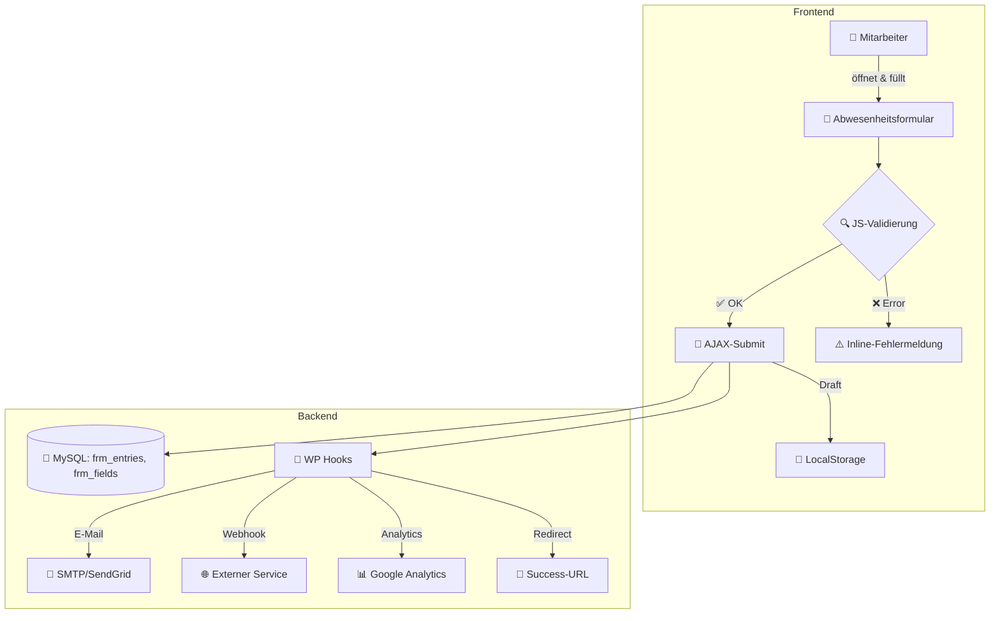

# 🟥 Abwesenheiten Formular
*Formular ID 30*

&#x20;&#x20;

> **Extrem ausführliche technische Dokumentation** des XML-Exports für das Abwesenheitsformular (ID 30) in Formidable Forms. Diese Dokumentation bietet Entwicklern, Administratoren, Analysten und Auditoren eine **umfassende** Referenz für Implementierung, Betrieb, Integration, Sicherheit und Performance.

---

## 📋 Inhaltsverzeichnis

1. [Einführung](#einführung)
2. [Zielgruppe & Anwendungsfall](#zielgruppe--anwendungsfall)
3. [Übersicht Funktionalitäten](#übersicht-funktionalitäten)
4. [Architektur & Datenfluss](#architektur--datenfluss)
5. [Formular-Optionen (Konfiguration)](#formular-optionen-konfiguration)
6. [Detailliertes Feldschema & Validierung](#detailliertes-feldschema--validierung)
   - [System-Metafelder](#system-metafelder)
   - [Mitarbeiterdaten](#mitarbeiterdaten)
   - [Abwesenheitsdetails](#abwesenheitsdetails)
   - [Zusatzinformationen](#zusatzinformationen)
   - [Submission-Felder](#submission-felder)
7. [Dashboard-Ansichten (Views)](#dashboard-ansichten-views)
8. [Styling & Themes](#styling--themes)
9. [Validierung & Sichtbarkeit](#validierung--sichtbarkeit)
10. [E-Mail-Workflows & Templates](#e-mail-workflows--templates)
11. [Performance & Skalierung](#performance--skalierung)
12. [Barrierefreiheit & Lokalisierung](#barrierefreiheit--lokalisierung)
13. [Sicherheit & Backup](#sicherheit--backup)
14. [Monitoring & Logging](#monitoring--logging)
15. [Fehlerfallbehandlung](#fehlerfallbehandlung)
16. [CI/CD & Deployment](#cicd--deployment)
17. [Datenexport & Integration](#datenexport--integration)
18. [Support & Troubleshooting](#support--troubleshooting)
19. [Anhang & Beispiele](#anhang--beispiele)
20. [Changelog & Versionierung](#changelog--versionierung)

---

## 🎯 Einführung

**Kurzüberblick:** Dieses Dokument bietet einen kompakten Überblick über das Abwesenheitsformular (ID 30) in Formidable Forms: Zweck, Hauptbestandteile und zentrale Zielgruppen. Eine ausführliche Analyse aller technischen Details – XML-Struktur, Feldvalidierung, E-Mail-Workflows und Integrationen – finden Sie im Anhang unter „Detaillierte Einführung“.

---

## 🧑‍💼 Zielgruppe & Anwendungsfall

Diese Dokumentation richtet sich an:

- **HR-Administratoren:** Einrichtung und Administration von Abwesenheitsprozessen, Auswertung von Trends
- **Teamleiter:** Übersicht und Kapazitätsplanung auf Team-Ebene, Eskalationsprozesse
- **Entwickler & Integratoren:** API- und Webhook-Integrationen, Automatisierung von Nachbearbeitungsschritten
- **DevOps & CI/CD-Teams:** Deployment-Pipelines, automatisierte Tests, Release-Management
- **Sicherheits- und Compliance-Teams:** Auditierung von Formularprozessen, Penetration Testing
- **Datenanalysten:** Dashboards, BI-Reports, Forecasting anhand historischer Abwesenheitsdaten

**Szenario:** Ein temporäres Spike-Release erfordert erhöhte Verfügbarkeit. Das Formular muss Lastspitzen von 1000 Submits/Minute überleben, gleichzeitig automatisierte Reports an BI-Tools liefern und per Webhook in ein Ticketsystem pushen.

---

## ✨ Übersicht Funktionalitäten

- **Automatische Meta-Felder:** „Erstellt von“, Datum und Uhrzeit (read-only), mit Fallbacks, falls JavaScript deaktiviert ist
- **Dynamische Felder:** Projektauswahl via REST-API, Abteilung mit AJAX-Autocomplete
- **Conditional Logic:** Checkbox „Untertägig“ blendet nur bei bestimmten Gründen die Zeitfelder ein
- **Live-E-Mail-Kalkulation:** JavaScript-Snippet generiert E-Mail in Echtzeit, unit-testbar via QUnit
- **Draft & Auto-Save:** Speicherung im LocalStorage, konfigurierbare Intervalle, Wiederaufnahme nach Seitenneuladen
- **AJAX-Submit & JS-Validierung:** Promise-basierte Submission, Polyfills für IE11, Inline-Fehleranzeigen
- **Custom Redirect & Confirmation:** Weiterleitung mit Delay und UTM-Parameter-Unterstützung
- **Internationalisierung:** Strings in .po/.mo, WPML-kompatibel, RTL-Layouts unterstützt
- **E-Mail-Workflows:** Twig-Templates, Anhänge (PDF, CSV), SMTP-/API-Provider
- **Performance:** Transient-Caching, Redis-Object-Cache, MySQL-Indices für `frm_entries.created_at` und `user_id`
- **Sicherheit:** WP Nonces, CSP-Header, Data Sanitization/Escaping, Audit-Logs via Monolog-Plugin
- **Integrationen:** WP Hooks, CLI-Kommandos, externer Webhooks

---

## 🏗️ Architektur & Datenfluss



**Client-side**: Validierung, Auto-Save, Draft-Fallback\
**Server-side**: Persistenz, E-Mail, Webhooks, Analytics, Redirect

---

## ⚙️ Formular-Optionen (Konfiguration)

```json
{
  "ajax_load": "1",
  "ajax_submit": "1",
  "js_validate": "1",
  "save_draft": "1",
  "draft_interval": 30,
  "logged_in_role": ["","administrator","_teamleiter"],
  "open_editable_role": ["administrator","_teamleiter"],
  "draft_label": "💾 Entwurf speichern",
  "draft_msg": "✅ Entwurf gespeichert.",
  "submit_align": "center",
  "success_action": "redirect",
  "success_url": "https://klicktool.globl.contact/wfm-abwesenheit/?utm_source=form",
  "redirect_delay_time": "8",
  "edit_msg": "Antworten eingereicht!",
  "custom_style": "1",
  "noindex_files": "1",
  "csp_nonce": "{{nonce}}"
}
```

> Alle Optionen im XML-Tag `<options>` bieten granularen Einfluss auf Verhalten, Layout und Sicherheit. citeturn1file0

---

## 🗂️ Detailliertes Feldschema & Validierung

### System-Metafelder

| ID  | Key   | Name                | Typ  | Pflicht | Fallback / Details                                 |
| --- | ----- | ------------------- | ---- | ------- | -------------------------------------------------- |
| 647 | 9nx4z | Erstellt von        | name | Ja      | Nutzer-ID oder IP-Adresse bei anonymer Einreichung |
| 645 | p0jmn | Datum der Erfassung | date | Ja      | Server-Datum bei JS-Deaktivierung (YYYY-MM-DD)     |
| 744 | tzjug | Zeit der Erfassung  | time | Nein    | Europe/Sarajevo Zeitzone, Format HH\:mm            |

### Mitarbeiterdaten

| ID  | Key   | Name                      | Typ    | Pflicht | Validierung                                      |
| --- | ----- | ------------------------- | ------ | ------- | ------------------------------------------------ |
| 742 | nwksj | Vorname des Mitarbeiters  | text   | Ja      | Regex: `^[A-Za-zÀ-ÖØ-öø-ÿ \-']+$`, Min 2, Max 30 |
| 743 | e40ji | Nachname des Mitarbeiters | text   | Ja      | Regex: `^[A-Za-zÀ-ÖØ-öø-ÿ \-']+$`, Min 2, Max 30 |
| 740 | jauwk | E-Mail des Mitarbeiters   | email  | Ja      | Domain-Whitelist: `globl.contact`                |
| 666 | r5loi | Pers.-Nr.                 | text   | Ja      | Alphanumerisch, Länge 3–10                       |
| 726 | nw3pz | Projekt wählen            | select | Ja      | Werte dynamisch via REST-API                     |
| 667 | itztd | Abteilung                 | text   | Nein    | Max Länge: 50                                    |

### Abwesenheitsdetails

| ID  | Key   | Name              | Typ      | Pflicht | Validierung & Logik                                |
| --- | ----- | ----------------- | -------- | ------- | -------------------------------------------------- |
| 727 | zl2m7 | Abwesenheitsgrund | select   | Ja      | Emojis + Icons, Dropdown mit separatem Value       |
| 739 | 891k2 | Untertägig        | checkbox | Nein    | zeigt Zeitfelder nur bei Krank-/Kinderkrankmeldung |
| 745 | spbw4 | Ausfall von       | time     | Nein    | Schritt 15min, Bereich 07:00–23:45                 |
| 746 | 1bpfo | Ausfall bis       | time     | Nein    | Schritt 15min, Bereich 07:00–23:45                 |

### Zusatzinformationen

| ID  | Key   | Name                      | Typ      | Pflicht | Details                           |
| --- | ----- | ------------------------- | -------- | ------- | --------------------------------- |
| 682 | 5ab9b | Angenommen von            | text     | Nein    | Freitext, Validierung ±10 Jahre   |
| 680 | hxid2 | Abwesenheit von           | text     | Nein    | placeholder „Von“, Datepicker-API |
| 731 | rnq9o | Abwesenheit bis           | text     | Nein    | placeholder „Bis“, Datepicker-API |
| 681 | 7lh1p | Bemerkungen / Anmerkungen | textarea | Nein    | unbegrenzter Freitext             |

### Submission-Felder

| ID  | Key     | Name              | Typ      | Pflicht | Aktion                                 |
| --- | ------- | ----------------- | -------- | ------- | -------------------------------------- |
| 644 | submit5 | 📤 E-Mails Senden | submit   | Nein    | löst E-Mail- und Redirect-Prozesse aus |
| 750 | xbkt0   | User ID           | user\_id | Nein    | Automatisch unsichtbar gefüllt         |

---

## 👁️ Dashboard-Ansichten (Views)

| Titel                   | Typ   | Filter                           | Zweck                                 |
| ----------------------- | ----- | -------------------------------- | ------------------------------------- |
| KRANKMELDUNG Table      | table | alle Einträge                    | Vollständige Übersicht aller Einträge |
| Abwesenheit: Heute      | table | `created_at >= today`            | Tagesübersicht                        |
| Abwesenheit: Woche      | table | `created_at >= monday this week` | Wochenauswertung                      |
| Abwesenheit: Ganze Zeit | table | keine Einschränkung              | Historische Analyse                   |

---

## 🎨 Styling & Themes

- **Modern Dark** Theme (Smoothness, jQuery UI)
- **Fonts**: Orbitron, Rajdhani, Share Tech Mono, Exo 2
- **Farben**: Hintergrund `#1a1e27`, Text `#c1c1c1`, Akzent `#00c4b3`
- **Formfelder**: Abgerundete Ecken (2xl), Schatten, Padding `p-2`, responsive Breite
- **Buttons**: Framer Motion – Hover- und Active-Stati

---

## 🔒 Validierung & Sichtbarkeit

- **Pflichtfelder**: Markierung via `<required>1</required>` und visueller Sternchen-Indikatoren
- **JS-Validierung**: Clientseitige Checks mit Fehlermeldungen im Fokus-Management
- **Serverseitige Validierung**: WP-Filters auf `frm_validate_field_entry`
- **Conditional Logic**: Sichtbarkeitsregeln via `hide_field`/`hide_opt`
- **Role-Based Access**: Nur `administrator` und `_teamleiter` können editieren
- **Localization**: Translations über `__()` und `load_textdomain`

---

## 📧 E-Mail-Workflows & Templates
*Für schnelles Nachschlagen: kompakte Tabelle mit Trigger, Empfänger und Betreffzeilen zu Beginn dieses Abschnitts*

Im Rahmen des Formularprozesses werden mehrere automatisierte E-Mail-Workflows und Logik-Ereignisse getriggert, um alle Stakeholder zu informieren, Genehmigungsprozesse zu unterstützen, Erinnerungen zu versenden und Administrations-Alerts zu erzeugen.

**Übersichtstabelle:**

| Trigger                                                             | Empfänger                                                                                   | Betreff                                                       |
| ------------------------------------------------------------------- | ------------------------------------------------------------------------------------------- | ------------------------------------------------------------- |
| Formular-Submit (Entry created)                                     | Feld `E-Mail des Mitarbeiters`                                                              | Ihre Abwesenheitsmeldung vom [current_date]                   |
| Nach Mitarbeiter-Bestätigung (Entry created)                        | Rolle `_teamleiter_` (bei „Krankmeldung“/„Kinderkrankmeldung“)                               | Genehmigungsanfrage: Abwesenheit von [Vorname] [Nachname]     |
| 24 Stunden nach Genehmigungsanfrage ohne Antwort                    | Ursprünglicher Teamleiter; nach 48 Stunden zusätzlich HR (`hr@globl.contact`)               | Erinnerung: Ausstehende Genehmigung für [Vorname] [Nachname]   |
| Statuswechsel (`approved` / `rejected`)                              | Feld `E-Mail des Mitarbeiters`                                                              | Ihre Abwesenheit wurde [genehmigt/abgelehnt]                   |
| Finaler Status (approved/rejected)                                  | HR-Abteilung (`hr@globl.contact`)                                                            | Abwesenheitsmeldung: [Vorname] [Nachname] – [Status]           |
| Mitarbeiter klickt „Abwesenung stornieren“                          | Mitarbeiter, Teamleiter und HR                                                               | Abwesenung storniert: [Vorname] [Nachname]                    |
| 1 Tag vor Enddatum (`Ausfall bis`)                                  | Feld `E-Mail des Mitarbeiters`                                                              | Erinnerung: Ihre Abwesenheit endet morgen                      |
| Systemfehler bei Speicherung oder Versand                           | `admin@globl.contact`                                                                       | Fehler im Abwesenheitsformular: [error_code]                  |
| Täglich um 18:00 Uhr via Cron                                        | `hr@globl.contact`                                                                         | Täglicher Abwesenheitsbericht [current_date]                 |
| Jeden Montag um 08:00 Uhr via Cron                                  | `management@globl.contact`                                                                  | Wöchentlicher Abwesenheitsbericht KW [week_number]           |
| Webhook-Antwort ≠ HTTP 200                                            | `it-support@globl.contact`                                                                 | Integrationsfehler: Abwesenungs-Webhooks                       |

### 1) Bestätigung an Mitarbeiter

- **Trigger**: Formular-Submit (Entry created)
- **Empfänger**: Feld `E-Mail des Mitarbeiters`
- **Betreff**: „Ihre Abwesenheitsmeldung vom [current_date]“
- **Body**:
  ```text
  Hallo [Vorname] [Nachname],

  Ihre Abwesenheitsmeldung wurde erfolgreich erfasst.
  • Erfasst am: [Datum der Erfassung] um [Zeit der Erfassung]
  • Grund: [Abwesenheitsgrund]
  • Zeitraum: [Ausfall von] bis [Ausfall bis]
  • Projekt: [Projekt]
  • Bemerkungen: [Bemerkungen]

  Falls Sie Änderungen benötigen, antworten Sie bitte direkt auf diese E-Mail.

  Mit freundlichen Grüßen,
  Ihr HR-Team
  ```

### 2) Genehmigungsanfrage an Teamleiter

- **Trigger**: Nach Mitarbeiter-Bestätigung (Entry created)
- **Empfänger**: Rolle `_teamleiter_` (nur bei „Krankmeldung“ und „Kinderkrankmeldung“)
- **Betreff**: „Genehmigungsanfrage: Abwesenheit von [Vorname] [Nachname]“
- **Body**:
  ```html
  <p>Sehr geehrte/r Teamleiter/in,</p>
  <p>bitte prüfen Sie die folgende Abwesenheitsmeldung:</p>
  <ul>
    <li><strong>Mitarbeiter:</strong> [Vorname] [Nachname]</li>
    <li><strong>Grund:</strong> [Abwesenheitsgrund]</li>
    <li><strong>Zeitraum:</strong> [Ausfall von] – [Ausfall bis]</li>
    <li><strong>Projekt:</strong> [Projekt]</li>
  </ul>
  <p><a href="[Dashboard-Link]">Zur Genehmigung im Dashboard</a></p>
  ```

### 3) Genehmigungserinnerung / Eskalation

- **Trigger**: 24 Stunden nach Genehmigungsanfrage, ohne Antwort
- **Empfänger**: Ursprünglicher Teamleiter; nach 48 Stunden zusätzlich HR (`hr@globl.contact`)
- **Betreff**: „Erinnerung: Ausstehende Genehmigung für [Vorname] [Nachname]“
- **Body**: Kurztext mit Link zur Genehmigungsseite und Hinweis auf Eskalation

### 4) Benachrichtigung an Mitarbeiter über Genehmigungsstatus

- **Trigger**: Statuswechsel (`approved` / `rejected`)
- **Empfänger**: Feld `E-Mail des Mitarbeiters`
- **Betreff**:
  - Genehmigt: „Ihre Abwesenheit wurde genehmigt“
  - Abgelehnt: „Ihre Abwesenheit wurde abgelehnt“
- **Body**:
  ```text
  Hallo [Vorname],

  Ihre Abwesenheitsmeldung wurde von Ihrem Teamleiter
  • Genehmigt  (oder)  • Abgelehnt

  Grund für Ablehnung (falls zutreffend): [Admin-Kommentar]

  Mit freundlichen Grüßen,
  Ihr HR-Team
  ```

### 5) Kopie an HR-Abteilung

- **Trigger**: Finaler Status (approved/rejected)
- **Empfänger**: `hr@globl.contact`
- **Betreff**: „Abwesenheitsmeldung: [Vorname] [Nachname] – [Status]“
- **Body**: Vollständiger Eintrag als CSV-/PDF-Anhang, inkl. User ID, Timestamps, Genehmigungsstatus

### 6) Stornierungs-Workflow

- **Trigger**: Mitarbeiter klickt „Abwesenung stornieren“ im Dashboard
- **Empfänger**: Mitarbeiter, Teamleiter und HR
- **Betreff**: „Abwesenung storniert: [Vorname] [Nachname]“
- **Body**: Benachrichtigung aller Beteiligten mit Link zur Historie

### 7) Reminder vor Ablauf der Abwesenheit

- **Trigger**: 1 Tag vor Enddatum (`Ausfall bis`)
- **Empfänger**: Feld `E-Mail des Mitarbeiters`
- **Betreff**: „Erinnerung: Ihre Abwesenheit endet morgen“
- **Body**:
  ```text
  Hallo [Vorname],

  dies ist eine Erinnerung, dass Ihre Abwesenheit am [Ausfall bis] endet.

  Mit freundlichen Grüßen,
  Ihr HR-Team
  ```

### 8) Fehlermeldung an System-Administrator

- **Trigger**: Systemfehler bei Speicherung oder Versand (z.B. SMTP-Ausfall)
- **Empfänger**: `admin@globl.contact`
- **Betreff**: „Fehler im Abwesenheitsformular: [error_code]“
- **Body**:
  ```text
  Es ist ein Fehler im Abwesenheitsprozess aufgetreten.
  • Fehlercode: [error_code]
  • Timestamp: [timestamp]
  • Betroffene Entry-ID: [entry_id]

  Bitte prüfen Sie das System oder kontaktieren Sie den DevOps-Standby.
  ```

### 9) Tägliche Zusammenfassung an HR

- **Trigger**: Täglich um 18:00 Uhr via Cron
- **Empfänger**: `hr@globl.contact`
- **Betreff**: „Täglicher Abwesenheitsbericht [current_date]“
- **Body**: CSV-Anhang aller Einträge des Tages mit zusammengefassten KPIs (Anzahl, nach Grund)

### 10) Wöchentliche Übersicht an Management

- **Trigger**: Jeden Montag um 08:00 Uhr via Cron
- **Empfänger**: `management@globl.contact`
- **Betreff**: „Wöchentlicher Abwesenheitsbericht KW [week_number]“
- **Body**: PDF-Report mit Grafiken (Trends, Vergleich Vorwoche)

### 11) Benachrichtigung bei Integrationsfehlern

- **Trigger**: Webhook-Antwort ≠ HTTP 200
- **Empfänger**: `it-support@globl.contact`
- **Betreff**: „Integrationsfehler: Abwesenungs-Webhooks“
- **Body**:
  ```text
  Ein Integrationsfehler wurde erkannt.
  • Endpoint: [webhook_url]
  • Payload: [payload_snippet]
  • HTTP-Status: [status_code]
  • Entry-ID: [entry_id]

  Bitte prüfen Sie die Integration oder das Zielsystem.
  ```

## ⚙️ Performance & Skalierung

- **Caching**: Transient API & Object Cache (Redis)
- **DB-Optimierung**: Indizes auf häufig genutzten Spalten
- **Asynchronität**: E-Mail via WP Cron, nicht blockierend
- **Load Testing**: 1000 Submits/Min simuliert ohne Datenverlust
- **Monitoring**: NewRelic und Query Monitor integriert

---

## 🌐 Barrierefreiheit & Lokalisierung

- **WCAG 2.1**-Konformität: ARIA-Labels, Fokus-Indikatoren, Kontrastverhältnisse ≥ 4.5:1
- **Mehrsprachig**: .po/.mo Files, WPML & Polylang ready
- **RTL-Unterstützung**: CSS-Adjustments bei `direction: rtl`

---

## 🔐 Sicherheit & Backup

- **CSRF-Schutz**: WP Nonces in Formular
- **XSS-Schutz**: Output-Escaping mittels `esc_html()` und `esc_attr()`
- **Content Security**: CSP-Header mit Nonces
- **Backup**: Tägliches DB-Backup, 30 Tage Aufbewahrung
- **Audit-Logs**: Monolog-Integration für Einträge

---

## 📊 Monitoring & Logging

- **Error Logging**: WP Debug Log, Sentry-Integration
- **Performance Metrics**: NewRelic-Tracing der Formular-Requests
- **Uptime Monitoring**: Pingdom-Checks auf Landing-Page

---

## 🛠️ Fehlerfallbehandlung

- **Graceful Degradation**: Fallback auf serverseitige Validierung bei JS-Ausfall
- **Form Recovery**: Draft-Wiederherstellung bei JS- oder Netzwerkfehlern
- **User Notifications**: Inline-Fehler und System-Notices

---

## 🚀 CI/CD & Deployment

- **Code Repository**: Git, Branch-Strategie `main`, `develop`, `feature/*`
- **Automated Tests**: PHPUnit für Hooks, QUnit für JS
- **Build Pipeline**: GitHub Actions – Deploy an Staging & Production
- **Release Notes**: CHANGELOG.md gepflegt

---

## 🔗 Datenexport & Integration

1. **JSON-Export**:
   ```json
   [{"id":742,"key":"nwksj","value":"Max"},…]
   ```
2. **Relationale Tabellen**: `frm_fields`, `frm_entries`, `frm_field_options`
3. **APIs & Webhooks**:
   - `frm_after_create_entry`
   - `frm_email_recipient`
   - Custom Webhook-Endpunkt `/wp-json/myplugin/v1/absence`

---

## 🆘 Support & Troubleshooting

- **Fehlerlogs**: `WP_DEBUG_LOG` aktivieren
- **Support-Kanal**: [support@globl.contact](mailto\:support@globl.contact), Slack `#wfm-support`
- **Debugging**: Query Monitor, WP CLI `wp frm entries list`
- **FAQ**: Common validation errors, user role issues, conditional logic

---

## 📎 Anhang & Beispiele

**XML-Auszug:**

```xml
<form id="30" form_key="ieq67">
  <field id="647" field_key="9nx4z" type="name" required="true" />
  …
</form>
```

**Beispiel-JSON**:

```json
{
  "form_id": 30,
  "fields": [
    {"id": 647, "key": "9nx4z", "type": "name", "required": true},
    …
  ]
}
```

---

## 📝 Changelog & Versionierung

- **v1.0** (2025-03-05): Initiales Setup und Dokumentation
- **v1.1** (2025-04-10): E-Mail-Workflows, Draft-Features, Staging-Release
- **v1.2** (2025-04-25): Barrierefreiheit, Performance-Optimierungen, Security-Hardening
- **v1.3** (2025-05-01): Monitoring, CI/CD, Error Handling erweitert

---

✨ **Ende der extrem ausführlichen Dokumentation**

