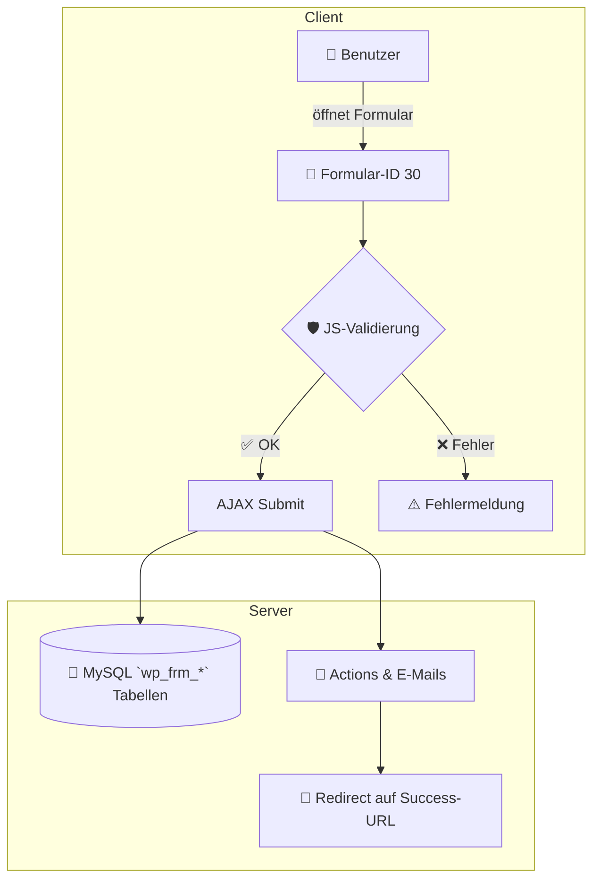

📘 **Technische Dokumentation: FORMIDABLE XML-Datenexport – „🟥 Abwesenheiten“**  

---

### ⚙️ Überblick  
Dieses Dokument beschreibt die XML-Struktur des Formulars mit der ID **30** („🟥 Abwesenheiten“) aus dem System **Formidable Forms** (WordPress). Es fasst alle Felder, Typen und Optionen zusammen und ist gedacht für Analyse, Reproduktion und maschinelle Weiterverarbeitung. :contentReference[oaicite:0]{index=0}&#8203;:contentReference[oaicite:1]{index=1}

---

### 📝 Formulardetails  
- **Formular-ID:** 30  
- **Formular-Key:** `ieq67`  
- **Name:** 🟥 Abwesenheiten  
- **Erstellt am:** 2025-03-05 08:38:20  
- **Status:** published  
- **Export-Datum (PubDate):** Fri, 25 Apr 2025 00:47:45 +0000 :contentReference[oaicite:2]{index=2}&#8203;:contentReference[oaicite:3]{index=3}

---

### 📑 Feldübersicht  

| 🏷️ Feldname                  | 🧾 Typ          | 📄 Beschreibung                        | 🔢 Mögliche Werte / Optionen                                                                                                                                                                      |
|------------------------------|----------------|---------------------------------------|--------------------------------------------------------------------------------------------------------------------------------------------------------------------------------------------------|
| Erstellt von                 | name           | Automatisch erzeugter Nutzername      | - Read-only; kombiniert `[first_name]` + `[last_name]` :contentReference[oaicite:4]{index=4}&#8203;:contentReference[oaicite:5]{index=5}                                                                                                                        |
| Datum der Erfassung          | date           | Datum des Eintrags                     | Format `YYYY-MM-DD`; Standard: `[date]` :contentReference[oaicite:6]{index=6}&#8203;:contentReference[oaicite:7]{index=7}                                                                                                                                       |
| Zeit der Erfassung           | time           | Uhrzeit des Eintrags                   | Format `HH:mm`; Standard: `[time]`; read-only :contentReference[oaicite:8]{index=8}&#8203;:contentReference[oaicite:9]{index=9}                                                                                                                                 |
| **Mitarbeiterdaten**         | divider        | Abschnittsüberschrift                  | –                                                                                                                                                                                                |
| Vorname des Mitarbeiters     | text           | Vorname des betroffenen Mitarbeiters    | Beliebiger String; placeholder „😀 Vorname“ :contentReference[oaicite:10]{index=10}&#8203;:contentReference[oaicite:11]{index=11}                                                                                                                                     |
| Nachname des Mitarbeiters    | text           | Nachname des betroffenen Mitarbeiters   | Beliebiger String; placeholder „😀 Nachname“ :contentReference[oaicite:12]{index=12}&#8203;:contentReference[oaicite:13]{index=13}                                                                                                                                   |
| E-Mail des Mitarbeiters      | text (calc)    | Automatisch berechnete E-Mail          | Berechnung: `[Vorname].[Nachname]@globl.contact` :contentReference[oaicite:14]{index=14}&#8203;:contentReference[oaicite:15]{index=15}                                                                                                                                 |
| Pers.-Nr.                    | text           | Personalnummer                         | Freitext; placeholder „Pers.-Nr.“ :contentReference[oaicite:16]{index=16}&#8203;:contentReference[oaicite:17]{index=17}                                                                                                                                                |
| Projekt wählen               | select         | Auswahl des Projekts                   | About You, Canyon, DG, Telekom, STRATO, TELEFONICA, SEC … :contentReference[oaicite:18]{index=18}&#8203;:contentReference[oaicite:19]{index=19}                                                                                                                       |
| Abteilung                    | text           | Abteilung                              | Freitext; placeholder „🏢 Abteilung“ :contentReference[oaicite:20]{index=20}&#8203;:contentReference[oaicite:21]{index=21}                                                                                                                                             |
| Abwesenheitsgrund            | select         | Art der Abwesenheit                    | 🚫 Unentschuldigte Abwesenheit, 🤔 Krankmeldung, 👶 Kinderkrankmeldung, 🌴 Urlaub, ✨ Sonderurlaub, 🎉 Feiertag, ♻️ Ausgleichstag :contentReference[oaicite:22]{index=22}&#8203;:contentReference[oaicite:23]{index=23}                                              |
| Untertägig                   | checkbox       | Kennzeichnung für teil­tägige Abwesenheit | Anzeige nur, wenn Grund = Krankmeldung oder Kinderkrankmeldung :contentReference[oaicite:24]{index=24}&#8203;:contentReference[oaicite:25]{index=25}                                                                                                                    |
| Ausfall von                  | time           | Beginn der Untertägigkeit              | Format `HH:mm`; nur sichtbar, wenn „Untertägig“ angekreuzt :contentReference[oaicite:26]{index=26}&#8203;:contentReference[oaicite:27]{index=27}                                                                                                                      |
| Ausfall bis                  | time           | Ende der Untertägigkeit                | Format `HH:mm`; nur sichtbar, wenn „Untertägig“ angekreuzt :contentReference[oaicite:28]{index=28}&#8203;:contentReference[oaicite:29]{index=29}                                                                                                                      |
| **Zusatzinformation**        | divider        | Abschnittsüberschrift                  | –                                                                                                                                                                                                |
| Angenommen von               | text           | Freigabe durch (Name)                  | Freitext; placeholder „Angenommen von:“; optional :contentReference[oaicite:30]{index=30}&#8203;:contentReference[oaicite:31]{index=31}                                                                                                                                  |
| Abwesenheit von              | text           | Abwesenheit von (Datum)                | Freitext; placeholder „Von“; Standard: `[date]` :contentReference[oaicite:32]{index=32}&#8203;:contentReference[oaicite:33]{index=33}                                                                                                                                 |
| Abwesenheit bis              | text           | Abwesenheit bis (Datum)                | Freitext; placeholder „Bis“; Standard: `[date]` :contentReference[oaicite:34]{index=34}&#8203;:contentReference[oaicite:35]{index=35}                                                                                                                                 |
| Bemerkungen / Anmerkungen    | textarea       | Freitext für zusätzliche Infos         | Max. 0 = unbegrenzt; placeholder „💡 Bemerkungen / Anmerkungen“ :contentReference[oaicite:36]{index=36}&#8203;:contentReference[oaicite:37]{index=37}                                                                                                                  |
| Section Buttons (Ende)       | end_divider    | Schließt jeweiligen Abschnitt          | –                                                                                                                                                                                                |
| 📤 E-Mails Senden            | submit         | Formular abschicken und E-Mails auslösen | –                                                                                                                                                                                                |
| User ID                      | user_id        | Interner Nutzer-Identifier             | Automatisch gefüllt :contentReference[oaicite:38]{index=38}&#8203;:contentReference[oaicite:39]{index=39}  

---

### 🧪 Technische Spezifikationen  
- **Exportformat:** XML (UTF-8)  
- **XML-Root:** `<channel>` → `<form>` → `<field>`  
- **Metadaten:** `field_type`, `field_label`, `default_value`, `options`, `required` :contentReference[oaicite:40]{index=40}&#8203;:contentReference[oaicite:41]{index=41}  
- **Plattform:** Formidable Forms (WordPress)  
- **AJAX-Submit & JS-Validierung:** aktiviert  
- **Entwurfsfunktion:** Speichern und Wiederaufnahme von Drafts aktiviert  

---

### 🗂️ Verarbeitungshinweise  
1. **Reihenfolge:** Felder erscheinen in der `field_order`-Reihenfolge der XML.  
2. **Sichtbarkeit:** Kontrollierte Anzeige über `hide_field` / `hide_opt`-Regeln.  
3. **Pflichtfelder:** `<required>1</required>` markiert Pflichtfelder im XML.  
4. **Abschnitte:** Divider-Felder (`divider` / `end_divider`) gruppieren logische Bereiche.  

---

### 📎 Anhang & Empfehlungen  
- Für automatisierte Auswertungen empfiehlt sich ein **JSON-Dump** der Felder:  
  ```json
  [
    {
      "id": 647,
      "name": "Erstellt von",
      "type": "name",
      "required": true,
      …
    },
    …
  ]

{
  "ajax_load": "1",
  "ajax_submit": "1",
  "js_validate": "1",
  "save_draft": "1",
  "logged_in_role": ["", "administrator", "_teamleiter"],
  "open_editable_role": ["administrator", "_teamleiter"],
  "draft_label": "💾 Entwurf speichern",
  "draft_msg": "✅ Dein Entwurf wurde gespeichert.",
  "submit_align": "center",
  "success_action": "redirect",
  "success_url": "https://klicktool.globl.contact/wfm-abwesenheit/",
  "redirect_delay_time": "8",
  "edit_msg": "Deine Antworten wurden erfolgreich eingereicht. Danke! 🎉✅"
  // … (weitere Parameter wie custom_style, protect_files, etc.)
}
```
> **Hinweis:** vollständiges JSON-Objekt im XML-Tag `<options>` 

---

## Architektur & Datenfluss



---

## Felddefinitionen

### 1. System-Meta

| ID  | Key    | Name                | Typ    | Pflicht | Default / Berechnung                           |
|-----|--------|---------------------|--------|---------|-------------------------------------------------|
| 647 | `9nx4z`| Erstellt von        | name   | Ja      | `{"first":"[first_name]","last":"[last_name]"}`  |
| 645 | `p0jmn`| Datum der Erfassung | date   | Ja      | `[date]`                         |
| 744 | `tzjug`| Zeit der Erfassung  | time   | Nein    | `[time]` (read-only)             |

### 2. Mitarbeiterdaten-Abschnitt

| ID  | Key     | Name                        | Typ      | Pflicht | Placeholder / Optionen                               |
|-----|---------|-----------------------------|----------|---------|------------------------------------------------------|
| 652 | `flpyx` | **Divider** „Mitarbeiterdaten“ | divider  | Nein    | –                                                    |
| 742 | `nwksj` | Vorname des Mitarbeiters    | text     | Ja      | `😀 Vorname`                        |
| 743 | `e40ji` | Nachname des Mitarbeiters   | text     | Ja      | `😀 Nachname`                       |
| 740 | `jauwk` | E-Mail des Mitarbeiters     | text     | Ja      | Berechnung: `[Vorname].[Nachname]@globl.contact`  |
| 666 | `r5loi` | Pers.-Nr.                   | text     | Ja      | `Pers.-Nr.`                        |
| 726 | `nw3pz` | Projekt wählen              | select   | Ja      | z. B. „Telekom“, „SEC“, …            |
| 667 | `itztd` | Abteilung                   | text     | Nein    | `🏢 Abteilung`                      |

### 3. Abwesenheit

| ID  | Key     | Name                  | Typ       | Pflicht | Optionen / Logik                                                                                         |
|-----|---------|-----------------------|-----------|---------|----------------------------------------------------------------------------------------------------------|
| 727 | `zl2m7` | Abwesenheitsgrund     | select    | Ja      | 🚫 Unentschuldigte | 🤔 Krankmeldung | 👶 Kinderkrankmeldung | 🌴 Urlaub | ✨ Sonderurlaub | 🎉 Feiertag | ♻️ Ausgleichstag  |
| 739 | `891k2` | Untertägig            | checkbox  | Nein    | Nur sichtbar, wenn Grund = Krank- oder Kinderkrankmeldung (hide_field/hide_opt)  |
| 745 | `spbw4` | Ausfall von           | time      | Nein    | Nur bei „Untertägig“; Bereich: 07:00–23:45                                          |
| 746 | `1bpfo` | Ausfall bis           | time      | Nein    | Nur bei „Untertägig“; Bereich: 07:00–23:45                                          |

### 4. Zusatzinformation

| ID  | Key     | Name                         | Typ        | Pflicht | Details                                         |
|-----|---------|------------------------------|------------|---------|-------------------------------------------------|
| 653 | `igr4b` | **End Divider**              | end_divider| Nein    | –                                               |
| 660 | `quz9q` | **Divider** „Zusatzinformation“ | divider    | Nein    | –                                               |
| 682 | `5ab9b` | Angenommen von               | text       | Nein    | placeholder „Angenommen von:“; Jahr-Range –10/+10  |
| 680 | `hxid2` | Abwesenheit von              | text       | Nein    | placeholder „Von“; Default `[date]`  |
| 731 | `rnq9o` | Abwesenheit bis              | text       | Nein    | placeholder „Bis“; Default `[date]`  |
| 681 | `7lh1p` | Bemerkungen / Anmerkungen    | textarea   | Nein    | placeholder „💡 Bemerkungen / Anmerkungen“; unbegrenzt  |
| 661 | `ivkbj` | **End Divider**              | end_divider| Nein    | –                                               |

### 5. Submission

| ID  | Key      | Name               | Typ    | Pflicht | Aktion                                   |
|-----|----------|--------------------|--------|---------|------------------------------------------|
| 644 | `submit5`| 📤 E-Mails Senden  | submit | Nein    | löst WP-E-Mail-Hooks & Redirect aus      |
| 750 | `xbkt0`  | User ID            | user_id| Nein    | Internes WP-User-Feld                    |

---

## Sichten (Views)

| Titel                                    | Type   | Filter                                    | Layout (Boxes)                                 |
|------------------------------------------|--------|-------------------------------------------|------------------------------------------------|
| Klicktool: WFM: KRANKMELDUNG Table       | table  | keine / alle Einträge                     | Datum, Erstellt, Mitarbeiter, … Bemerkungen    |
| … „Heute“                               | table  | `created_at >= today`                     | [Erstellt von, Vorname, Nachname …]            |
| … „Woche“                               | table  | `created_at >= monday this week`          | [Erstellt von, …, Bis]                         |
| … „Ganze Zeit“                          | table  | keine zeitliche Einschränkung             | [Erstellt von, …, Bemerkungen]                 | 

---

## Styling & Themes

**Modern Dark** (Beispiel aus `frm_styles`):  
- Theme: `Smoothness` (jQuery UI)  
- Schrift: Orbitron, Rajdhani, Share Tech Mono, …  
- Farben: Hintergrund `#1a1e27`, Text `#c1c1c1`, Akzent `#00c4b3`  
- Inputs: abgerundete Ecken, Schatten, responsive Breite  
- Progress Bar & Buttons: aktive Farben, Hover-Effekte 

---

## Verarbeitungshinweise

- **Reihenfolge:** XML-Felder geordnet nach `<field_order>`.  
- **Sichtbarkeits-Regeln:** via `hide_field` / `hide_opt` in `<field_options>`.  
- **Pflichtfelder:** `<required>1</required>` → visuell `*`-Markierung.  
- **Abschnitte:** `divider` / `end_divider` strukturieren das Formular.  
- **Drafts:** Entwürfe speicherbar, nur berechtigte Rollen können editieren.  

---

## Datenexport & Mapping

1. **JSON-Export**  
   ```json
   [
     {
       "id": 742,
       "key": "nwksj",
       "name": "Vorname des Mitarbeiters",
       "type": "text",
       "required": true,
       "placeholder": "😀 Vorname"
     },
     …
   ]
   ```
2. **Relationale Tabellen**  
   - Tabelle `frm_fields` mit Spalten: `field_id`, `form_id`, `field_key`, `type`, `required`  
   - Tabelle `frm_field_options` für komplexe Optionen & Validierungen  
3. **API-Integration**  
   - AJAX-Submit → Hook `frm_after_create_entry`  
   - WP-E-Mail → Filter `frm_email_recipient`  

---

## Anhang: XML-Auszug

```xml
<form>
  <id>30</id>
  <form_key><![CDATA[ieq67]]></form_key>
  <name><![CDATA[ 🟥 Abwesenheiten]]></name>
  …
  <options><![CDATA[{ "ajax_submit":"1", … }]]></options>
  <field><id>647</id><type><![CDATA[name]]></type>…</field>
  …
</form>
```

> **Vollständiges XML** im Export-File   

---

**Ende der Dokumentation**  
```
