# 📋 Klicktool WFM – Abwesenheiten (Formular‑ID 30)
🚀 Next‑Level Technische Dokumentation  
Mit Flow‑Diagrammen für maximale Übersichtlichkeit

---

## 📖 Inhaltsverzeichnis
1. [Architekturübersicht](#-architekturübersicht)
2. [Allgemeine Kanal‑Metadaten](#-allgemeine‑kanal‑metadaten)
3. [Formulareinstellungen (`<form>`)](#-formulareinstellungen-form)
4. [Felder (`<field>`)](#-felder-field)
5. [Ansichten & Aktionen (`<view>`)](#-ansichten--aktionen-view)
6. [Flow‑Diagramme](#-flow-diagramme)
   1. [Formular‑Lifecycle](#1-formular-lifecycle)
   2. [E‑Mail‑Trigger‑Flow](#2-e‑mail-trigger-flow)
7. [Beispiele](#-beispiele)
8. [Zusammenfassung](#-zusammenfassung)

---

## 🏛 Architekturübersicht

```mermaid
flowchart TD
  subgraph Client
    U[👤 Benutzer] -->|öffnet Formular| F[📄 Formular‑ID 30]
    F --> V{🛡️ Client‑Validierung}
    V -->|✅ OK| S[💾 Speicherung]
    V -->|❌ Fehler| E[⚠️ Fehlermeldung]
  end

  subgraph Server
    S --> DB[(🔒 Datenbank)]
    S --> A[🔧 Ansichten & Aktionen]
    A --> V1[📋 Tabellen‑Views]
    A --> Evt[📧 E‑Mail Aktionen]
  end
```


---

## 🔍 Allgemeine Kanal‑Metadaten
| 🔑 Schlüssel       | 📄 Wert                                      |
|--------------------|----------------------------------------------|
| **Titel**          | Globl Ambasador                              |
| **Veröffentlicht** | 25. Apr 2025 00:47 UTC                       |
| **Erstellt**       | 05. Mär 2025 08:38                           |
| **Status**         | ✅ published                                 |
| **Beschreibung**   | XML‑Schema für Abwesenheits‑Formular & Views |

---

## 🛠 Formulareinstellungen (`<form>`)
| 🔑 Attribut        | 📦 Typ / Werte                         | 📝 Beschreibung                          |
|--------------------|----------------------------------------|------------------------------------------|
| `id`               | Integer (z. B. 30)                     | Formular‑ID                              |
| `form_key`         | String (CDATA)                         | Einmaliger interner Schlüssel            |
| `name`             | String (CDATA)                         | „🟥 Abwesenheiten“                       |
| `description`      | String (CDATA)                         | Freitext, leer                           |
| `created_at`       | Timestamp                              | Erstellungszeitpunkt                     |
| `logged_in`        | 0 / 1                                  | Öffentlich / Nur eingeloggte             |
| `is_template`      | 0 / 1                                  | Kein Template / Template                 |
| `editable`         | 0 / 1                                  | Nicht editierbar / Editierbar            |
| `options`          | JSON‑Block                             | Ajax, Validierung, Rollen, Draft‑Speich. |
| `status`           | `published` / `draft`                  | Publiziert oder Entwurf                  |
| `parent_form_id`   | Integer                                | Übergeordnet (0 = keines)                |

---

## 📋 Felder (`<field>`)
| 🆔 ID | 🔑 Key   | 🏷 Name                      | 📦 Typ      | ✅ Pflicht | 🎯 Default        | 📖 Beschreibung                                   |
|-------|----------|-----------------------------|-------------|------------|-------------------|---------------------------------------------------|
| 647   | `9nx4z`  | Erstellt von                | `name`      | Ja         | `{"first":"…"}`| 👤 Autovervollst. Vorname + Nachname              |
| 645   | `p0jmn`  | Datum der Erfassung         | `date`      | Ja         | `[date]`          | 📅 Heutiges Datum (YYYY‑MM‑DD)                    |
| 744   | `tzjug`  | Zeit der Erfassung          | `time`      | Nein       | `[time]`          | ⏰ Aktuelle Uhrzeit (HH:MM, 24 h)                 |
| 652   | `flpyx`  | **Mitarbeiterdaten**        | `divider`   | –          | –                 | Trennt Abschnitt                                  |
| 742   | `nwksj`  | Vorname des Mitarbeiters    | `text`      | Ja         | –                 | ✍️ Platzhalter „👤 Vorname“                        |
| 743   | `e40ji`  | Nachname des Mitarbeiters   | `text`      | Ja         | –                 | ✍️ Platzhalter „👤 Nachname“                       |
| 740   | `jauwk`  | E‑Mail des Mitarbeiters     | `text`      | Ja         | –                 | 📧 Vorname.Nachname@globl.contact                 |
| 666   | `r5loi`  | Pers.-Nr.                   | `text`      | Ja         | –                 | 🔢 Personalnummer                                |
| 726   | `nw3pz`  | Projekt wählen              | `select`    | Ja         | –                 | ▶️ About You, Canyon, DG, Telekom, STRATO, …      |
| 667   | `itztd`  | Abteilung                   | `text`      | Nein       | –                 | 🏢 Freitext                                       |
| 727   | `zl2m7`  | Abwesenheitsgrund           | `select`    | Ja         | –                 | 🚫 Unentschuldigt, 🤒 Krankmeldung, 🌴 Urlaub, …  |
| 739   | `891k2`  | Untertägig                  | `checkbox`  | Nein       | –                 | Nur bei Krankmeldung anzeigen                   |
| 745   | `spbw4`  | Ausfall von                 | `time`      | Nein       | –                 | Startzeit HH:MM                                  |
| 746   | `1bpfo`  | Ausfall bis                 | `time`      | Nein       | –                 | Endzeit HH:MM                                    |
| 681   | `7lh1p`  | Bemerkungen / Anmerkungen   | `textarea`  | Nein       | –                 | 📝 Freitext                                       |
| 644   | `submit5`| 📤 E‑Mails Senden            | `submit`    | Nein       | –                 | Löst E‑Mail‑Aktionen aus                         |
| 750   | `xbkt0`  | User ID                     | `user_id`   | Nein       | –                 | Internes Nutzer‑ID                               |

---

## 👁️ Ansichten & Aktionen (`<view>`)
- **Tabellen‑Views** (`frm_display`): Tages‑, Wochen‑, Gesamt‑Ansicht  
- **E‑Mail‑Aktionen** (`frm_form_actions`):  
  - 📧 Trigger: `event: ["create"]`  
  - 📨 Empfänger je Projekt  
  - ⚙️ Bedingungen via `conditions`

---

## 🌊 Flow‑Diagramme

### 1. Formular-Lifecycle

```mermaid
flowchart LR
  U[👤 Benutzer] -->|öffnet Formular| F[📄 Formular 30]
  F --> V{🛡️ JS‑Validierung}
  V -->|✅ OK| S[💾 Speichern]
  V -->|❌ Fehler| E[⚠️ Fehlermeldung]
  S --> DB[(🔒 DB)]
  S --> V1[📋 Views generieren]
  S --> Evt[📧 E‑Mail Aktionen]
```


### 2. E‑Mail‑Trigger‑Flow
```mermaid
flowchart TD
  S[Eintrag erstellt] --> C{Projekt?}
  C -->|Telefonica| E1[E‑Mail an telefonica-tl@…]
  C -->|STRATO|   E2[E‑Mail an strato-tl@…]
  C -->|DG|       E3[E‑Mail an dg-tl@…]
  C -->|…|        E4[E‑Mail an …]
  E1 --> R[✅ Erfolgsseite]
  E2 --> R
  E3 --> R
  E4 --> R
```

---

## 🛠 Beispiele
**Formular‑Snip­pet**
```xml
<form>
  <id>30</id>
  <name><![CDATA[ 🟥 Abwesenheiten ]]></name>
  <created_at>2025-03-05 08:38:20</created_at>
  <editable>1</editable>
  <status><![CDATA[ published ]]></status>
</form>
```

**Feld‑Snippet: Abwesenheitsgrund**
```xml
<field>
  <id>727</id>
  <name><![CDATA[ Abwesenheitsgrund ]]></name>
  <type><![CDATA[ select ]]></type>
  <options><![CDATA[
    [
      {"label":"🚫 Unentschuldigt","value":"unentschuldigt"},
      {"label":"🤒 Krankmeldung","value":"krankmeldung"},
      …
    ]
  ]]></options>
</field>
```

---

## ✅ Zusammenfassung
- 🌟 **Next‑Level:** Übersichtliche Flow-Diagramme  
- 🔍 **Detailtiefe:** Alle Felder, Optionen, Views & Aktionen dokumentiert  
- 🔧 **Modular:** Klare Trennung von Formular-Settings, Feld-Definitionen & Views  
- 📈 **Skalierbar:** Einfach erweiterbar durch JSON‑Optionen

> Dieses README.md bietet Entwicklern & Administratoren einen umfassenden, visuellen & modularen Leitfaden für das Abwesenheits-Formular im Klicktool.

