# 🟥 Abwesenheiten – Dokumentacija u Markdown formatu

**Tehničke specifikacije**  
- **Form ID**: `30`  
- **Form Key**: `ieq67`  
- **Naziv forme**: `🟥 Abwesenheiten`  
- **Kreirano**: `2025-03-05 08:38:20`  
- **Opcije**: `ajax_load: 1`, `ajax_submit: 1`, `js_validate: 1`, `save_draft: 1`  
- **Auto-Email logika**: Script u `after_html` ažurira E-Mail Feld-ID **730** po obrascu `<first>.<last>@globl.contact`  

---

## 1. Sequence Diagram


## 2. Class Diagram

```mermaid
classDiagram
    class Form {
        +int id
        +string form_key
        +string name
        +map options
    }
    class Field {
        +int id
        +string field_key
        +string name
        +string type
        +bool required
    }
    class EmailScript {
        +int field_id
        +string domain
        +function updateEmail()
    }
    Form "1" --* "n" Field : sadrži
    Form o-- EmailScript : koristi
```


## 3. State Diagram

```mermaid
stateDiagram-v2
    [*] --> Draft
    Draft --> Published : admin objavi
    Published --> Submitted : korisnik pošalje
    Submitted --> [*]
    Draft --> Deleted : admin izbriše
```


## 4. Entity-Relationship Diagram (ERD)


## 5. User Journey
```mermaid
userJourney
    title Korisnik popunjava Abwesenheiten-formu
    section Pristupanje
      Otvoriti link: 5: U
      Pregled forme: 4: U
    section Popunjavanje
      Unos imena: 4: U
      Unos datuma: 3: U
      Izbor razloga: 2: U
    section Slanje
      Klik Submit: 4: U
      AJAX Submit: 3: S
      Redirect: 2: U
```

## 6. Gantt Chart


## 7. Pie Chart


## 8. Quadrant Chart
```mermaid
quadrantChart
    title Polja po važnosti i složenosti
    x-axis Visoka složenost --> Niska složenost
    y-axis Kritično --> Opcionalno
    "Erstellt von": [8,8]
    "E-Mail des Mitarbeiters": [9,7]
    "Abwesenheitsgrund": [7,9]
    "Bemerkungen": [3,4]
```

## 9. Requirement Diagram
```mermaid
requirementDiagram
    requirement FORM_REQ {
        id: R1
        text: "Ajax submit must work"
    }
    requirement EMAIL_AUTO {
        id: R2
        text: "Email auto-generation on input"
    }
    FORM_REQ --> EMAIL_AUTO
```

## 10. Gitgraph (Commit grananje)


## 11. C4 Model
### Context
```mermaid
C4Context
    title C4 Context
    Person(user, "Korisnik")
    System(webApp, "Klicktool WFM")
    user -> webApp : "Popunjava formu"
```
### Container
```mermaid
C4Container
    title C4 Container
    System_Boundary(s1, "WFM System") {
      Container(web, "Web Frontend", "React + Ajax")
      Container(api, "API Server", "PHP/WordPress")
      ContainerDb(db, "MySQL DB", "Form data")
    }
    web -> api : REST/JSON
    api -> db : Read/Write
```
### Component
```mermaid
C4Component
    title C4 Component
    Container(api, "API Server") {
      Component(FormController, "FormController", "CRUD forme")
      Component(EmailService, "EmailService", "Auto-email logic")
    }
    FormController -> EmailService : uses
```
### Code
```mermaid
C4Code
    title C4 Code Snippet
    snippet “email.js” {
      function updateEmail(first, last) {
        return `${first}.${last}@globl.contact`;
      }
    }
```

## 12. Mindmap

```mermaid
mindmap
  root((🟥 Abwesenheiten))
    Specifikacije
      IDs
      Form Key
      Opcije
    Polja
      Erstellt von
      Datum
      Email
      …
    Logika
      Ajax Submit
      Auto-Email
    Integracije
      DB
      Redirect
```


## 13. Timeline

```mermaid
timeline
    title Ključni događaji
    2025-03-05 : Forma kreirana
    2025-03-06 : Prvi unosi
    2025-03-07 : Objavljen WFM view
    2025-04-09 : Privatni prikaz “Heute”
    2025-04-23 : Nove tabele za “Woche” i “Ganze Zeit”
```


## 14. Sankey Diagram
```mermaid
sankeyDiagram
    A[User Input] 0.8 --> B[AJAX Submit]
    B 0.8 --> C[Server Validation]
    C 0.7 --> D[DB Write]
    D 0.7 --> E[Success Redirect]
    A[User Input] 0.2 --> F[Draft Save]
    F --> G[Draft Storage]
```

## 15. XY (Scatter/Line) Chart
```mermaid
scatterChart
    title Field order vs Required
    x-axis Redoslijed polja
    y-axis Obavezno (1) / Neobavezno (0)
    "Erstellt von": [2,1]
    "Bemerkovanja": [32,0]
    "Abwesenheitsgrund": [18,1]
```

## 16. Block Diagram


## 17. Packet Diagram


## 18. Kanban Board
```markdown
| To Do                          | In Progress               | Done                  |
|--------------------------------|---------------------------|-----------------------|
| Definirati polja (XML)         | Implementirati auto-email | Objaviti formu        |
| Navesti requirement dijagram   | Kreirati ERD              | CRUD kontroler gotov  |
| Nacrtati C4 kontejnere         | Dodati draft funkcionalnost | Test Ajax submit    |
```

## 19. Architecture Diagram
```mermaid
flowchart LR
    User -->|HTTPS| Nginx[Reverse Proxy]
    Nginx --> PHPFPM[PHP-FPM]
    PHPFPM --> WP[WordPress Core]
    WP --> DB[(MySQL)]
    WP --> Redis[(Cache)]
    EmailService --> SMTP[(Mail Server)]
```

## 20. Radar Chart
```mermaid
radarChart
    title Pokrivenost funkcionalnosti
    axisLabels Ajax, Validation, Draft, Email, Redirect, Security
    "Features": [5,4,3,4,5,2]
```

